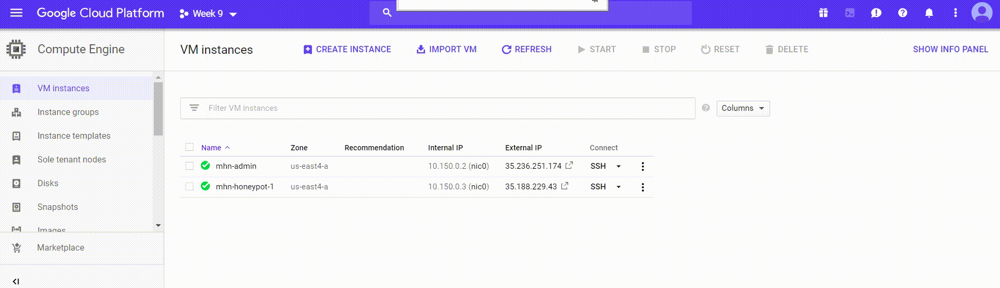
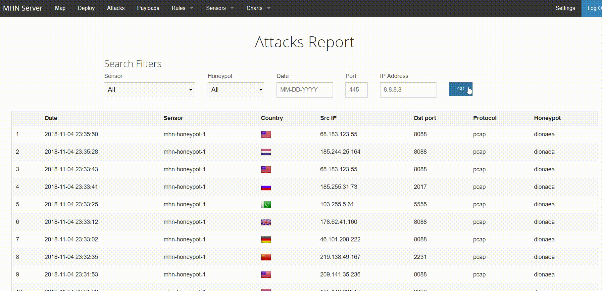

# Project_9
session.json: https://github.com/Xiaoddd/Project_9/blob/master/session.json
# Which Honeypot(s) you deployed
   mhn-honeypot-1
   
# Any issues you encountered
   I created it a number of times and had a hard time with the first deploying. 
# A summary of the data collected: number of attacks, number of malware samples, etc.
   163 data collected. 
   163 attacked. 
   
# Any unresolved questions raised by the data collected
   I can't open external IP by clicking it. I had to copy and paste it to the new tab then open it. 
